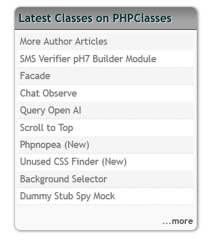

# phpclasses_latest

## Description

Displays a box with other articles of the author.

The contents can be displayed in the current or in all languages where texts are available.

***

## Management

The block is managed through the ASCOOS Explorer program

 

We can configure its contents from the parameters

***

 

## Documentation

You can find more information about the block on the documentation page of [Ascoos CMS - BLOCKS - More Author Articles Documantation](https://docs.ascoos.com/ascoos/ext/blocks/phpclasses-latest/tutorial-en.html)

***

## Feedback

Please send any feedback or suggestions to [@ascoos](https://x.com/ascoos) (X - Twitter) or [create an issue](https://github.com/ascoos/phpclasses_latest/issues) on GitHub.

*** 
 
## License

[AGL (ASCOOS General License)](http://docs.ascoos.com/lics/ascoos/AGL.html)

***

## Download

- [ASCOOS CMS More Author Articles from Original Download site](https://dl.ascoos.com/cms/ascoos/ext/blocks/phpclasses_latest/phpclasses_latest-latest.zip)

- [ASCOOS CMS  More Author Articles from Github](https://github.com/ascoos/phpclasses_latest/releases)
